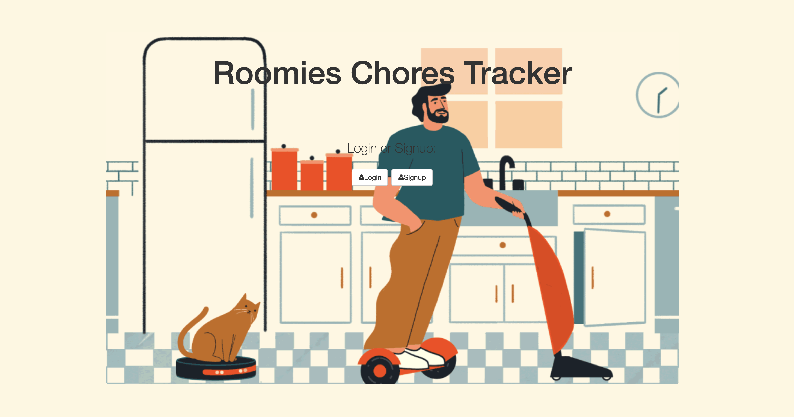

# Rommies Chores Tracker

## Goal:

Full-stack web application that help to keep track of chores between roomates. User can update completed chore by thumbs up and delete it after.

## How It's Made:

**Tech Used**: HTML5, CSS3, APIs, Javascript, Node.js, MongoDB, Express framework

## Installation

1. Clone repo
2. run `npm install`

## Usage

1. run `node server.js`
2. Navigate to `localhost:8080`

## Credit

Modified from Scotch.io's auth tutorial
